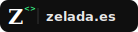

<picture>
  <source media="(prefers-color-scheme: dark)" srcset="./assets/banner.svg">
  <source media="(prefers-color-scheme: light)" srcset="./assets/banner-light.svg">
  
</picture>

 

I build backend systems and ML pipelines. I break things, fix them, and deploy them on AWS. Based in Spain.

---

### Skills

**Systems / Languages**

**ML / AI**

`XGBoost` `MLflow` `Optuna` `Evidently AI` `LLMs`

**Backend**

**Web**

---

### Projects

**[SentiLife](https://github.com/jzelada97/SentiLife)** &nbsp; 

Group project — fall detection platform built on an Event-Driven Architecture. I led the backend: REST APIs secured with Spring Security and JWT, async processing via Virtual Threads, RabbitMQ integration, and full observability with Prometheus, Micrometer and Grafana. Data analysis notebooks with Python and Pandas. CI/CD with GitHub Actions and deployment on AWS.

`Java 21` `Spring Boot 3` `RabbitMQ` `PostgreSQL` `Docker` `AWS` `Prometheus` `Grafana` `Python` `GitHub Actions`

**Housing Price Predictor** &nbsp; 

Housing price prediction in Madrid using XGBoost with a full MLOps pipeline deployed on Render.

`Python` `XGBoost` `MLflow` `Optuna` `Evidently AI`

**Productivity App** &nbsp; 

Mobile productivity app with tasks, calendar, subtasks, priorities, time estimates and notifications.

`React Native` `Expo` `Supabase` `TypeScript`

**Weekly Meal Planner** &nbsp; 

Weekly recipe planner with auto-generated shopping list. Filter by protein, scale by servings.

`React` `TypeScript` `Firebase`

**42 School** — Low-level C projects: [push_swap](https://github.com/jzelada97/push_swap) · [pipex](https://github.com/jzelada97/pipex) · [minitalk](https://github.com/jzelada97/minitalk) · [so_long](https://github.com/jzelada97/so_long)

---

### Find me

<a href="mailto:josecarloszv97@gmail.com">
  <picture>
    <source media="(prefers-color-scheme: dark)" srcset="./assets/gmaildark.svg">
    <source media="(prefers-color-scheme: light)" srcset="./assets/Gmail-Light.svg">
    
  </picture>
</a>
&nbsp;

&nbsp;

